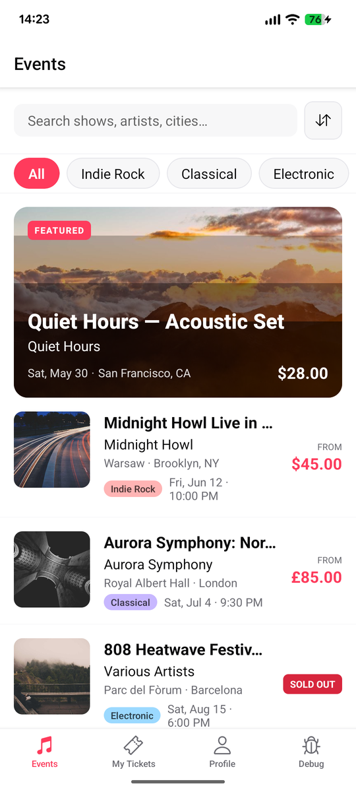
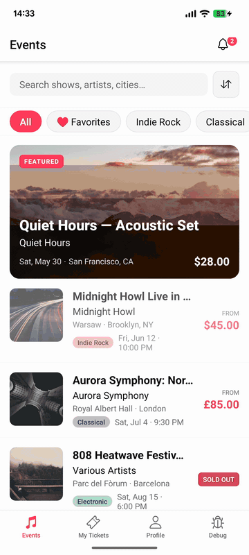
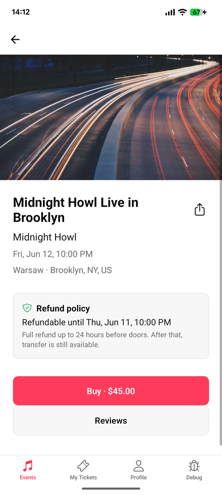
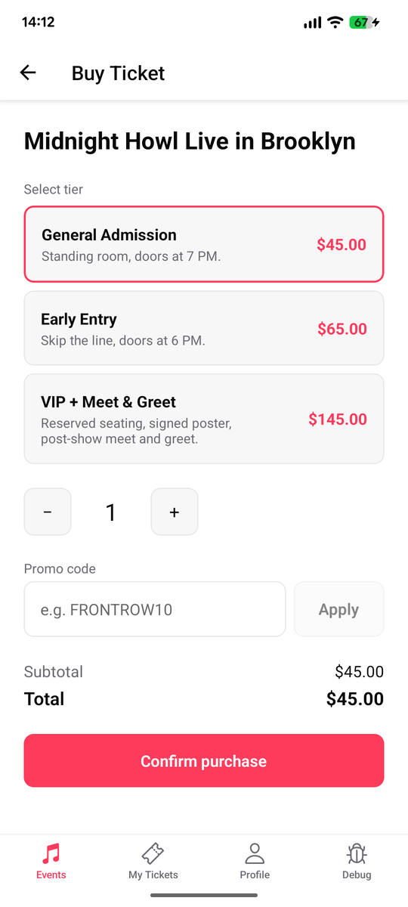
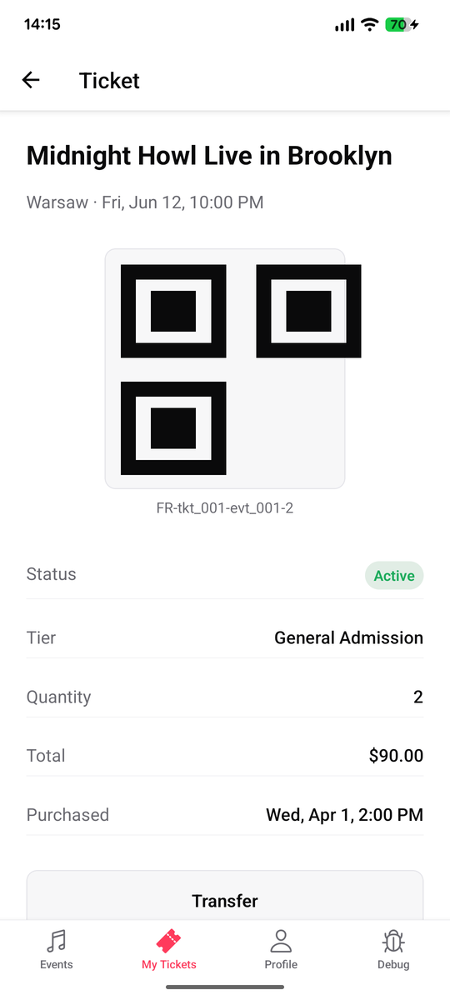
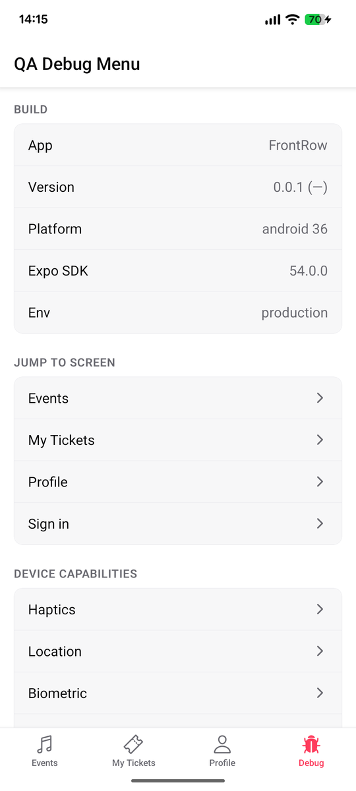
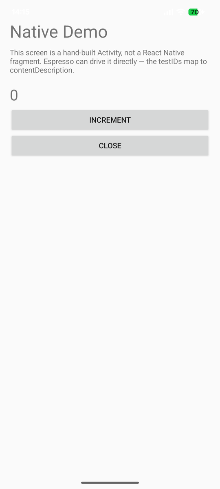

<div align="center">

# FrontRow

**An open-source mobile app designed as a QA automation training playground.**

[](LICENSE)
[](https://github.com/majdukovic/frontrow/actions/workflows/ci.yml)
[](../../releases)
[](#install-a-prebuilt-binary)
[](https://expo.dev)

<br />



<br />

A concert & events ticketing app built for QA engineers. Stable test IDs, a deep QA Debug Menu, deterministic seed data, bridged native screens, and ready-to-run flows for Maestro, Appium, Espresso, and XCUITest — all targeting the same identifiers.

Clone, run on a simulator in under five minutes, then use it to learn — or teach — mobile test automation against a realistic surface.

</div>

## See it in action

A Maestro flow driving the ticket-purchase journey — events list → event detail → tier selection → confirmation — captured on a Pixel 7a running the release APK:

<p align="center">
  
</p>

The full flow YAML — the entire test that produced that recording:

```yaml
# tests/maestro/tickets/buy.yaml
appId: app.frontrow.qa
---
- runFlow: ../_setup.yaml # signs in the demo user via deep link

- tapOn:
    id: 'tab.events'
- assertVisible:
    id: 'screen.events'
- tapOn:
    id: 'events.item.evt_001'
- assertVisible:
    id: 'screen.eventDetail'

- tapOn:
    id: 'eventDetail.buyButton'
- assertVisible:
    id: 'screen.buyTicket'
- tapOn:
    id: 'buyTicket.payButton'

- assertVisible: 'Ticket purchased'

- tapOn:
    id: 'tab.myTickets'
- assertVisible:
    id: 'screen.myTickets'
```

And a JS-to-native bridge flow exercising a hand-rolled Swift `UIViewController` / Kotlin `Activity` from the QA Debug Menu:

```yaml
# tests/maestro/native/native-demo.yaml (excerpt)
appId: app.frontrow.qa
---
- runFlow: ../_setup.yaml
- tapOn:
    id: 'tab.debug'
- scrollUntilVisible:
    element:
      id: 'debug.openNativeDemo'
    direction: DOWN
- tapOn:
    id: 'debug.openNativeDemo'
- assertVisible: '0'
- tapOn: 'Increment'
- tapOn: 'Increment'
- assertVisible: '2'
- tapOn: 'Close'
```

Both flows pass on Android emulator and iPhone simulator without changes — the `id:` matchers map to `resource-id` on Android and `accessibilityIdentifier` on iOS via the central registry in [`src/testIds.ts`](src/testIds.ts).

## Screen tour

<table>
  <tr>
    <td align="center"><br /><sub><b>Events feed</b></sub></td>
    <td align="center"><br /><sub><b>Event detail + lineup</b></sub></td>
    <td align="center"><br /><sub><b>Tier picker</b></sub></td>
  </tr>
  <tr>
    <td align="center"><br /><sub><b>Your ticket (QR)</b></sub></td>
    <td align="center"><br /><sub><b>QA Debug Menu</b></sub></td>
    <td align="center"><br /><sub><b>Bridged native screen</b></sub></td>
  </tr>
</table>

## Why this exists

- Most existing open-source samples cover login + cart and stop there.
- Nothing systematically exercises date control, location mocking, IAP simulation, purchase restoration, microphone, haptic feedback, biometric auth, push, deep-link-to-anywhere, and seedable scenarios all in one place.

FrontRow fills that gap. MIT-licensed, fork-friendly, no backend required.

## Quick start

Requires Node 20+ and either Xcode or Android Studio.

```bash
git clone <this repo>
cd frontrow
npm install
npm run ios       # or: npm run android
```

That's it. No backend to run, no accounts to create, no secrets to configure.

> Some Phase 5+ capabilities (MMKV, real local notifications) require a development build. The standard `npm run ios` / `npm run android` covers that — Expo Go alone is not enough once `expo prebuild` has run.

### On a real device

The defaults above target a simulator/emulator. To build from source onto a USB-connected phone:

**Android phone**

1. Enable Developer Options → USB debugging on the phone.
2. Plug it in and confirm `adb devices` lists it as `device` (not `unauthorized`).
3. `npm run android` — `expo run:android` auto-detects the connected device and prompts if both an emulator and a phone are available.

**iPhone**

1. Open `ios/FrontRow.xcworkspace` in Xcode at least once, pick your team under Signing & Capabilities, and change the bundle identifier from `app.frontrow.qa` to something unique to your account (mirror the change in `app.config.ts`). A free Apple ID works for development builds.
2. Trust your developer certificate on the device: Settings → General → VPN & Device Management.
3. `npm run ios -- --device` — passes through to `expo run:ios --device`, which lists connected iPhones to pick from. The first build is slow; subsequent ones are fast.

If you just want to poke at the app without a toolchain, grab the prebuilt artifacts from [Releases](https://github.com/majdukovic/frontrow/releases) — Android sideloads on real devices, iOS is Simulator-only.

## Install a prebuilt binary

Grab the latest artifacts from the [Releases page](https://github.com/majdukovic/frontrow/releases) — each tagged release ships an Android APK and an iOS Simulator `.app.zip` so you can poke at FrontRow without setting up a React Native toolchain.

### Android — `FrontRow.apk` (real device or emulator)

The APK is a release-variant build signed with a debug keystore. It installs side-by-side with anything from the Play Store, but `adb` and the device installer will both flag it as "from an unknown source" — that's expected.

**On an emulator** (Android Studio AVD running):

```bash
adb install FrontRow.apk
adb shell am start -n app.frontrow.qa/.MainActivity
```

**On a real device** (USB debugging enabled, device paired with `adb devices`):

```bash
adb install -r FrontRow.apk
```

**No `adb`?** Email/AirDrop/download the APK to the device, tap it in Files, accept the "install unknown apps" prompt for whatever app is handling it (usually Chrome or Files). The app launches from the home screen as **FrontRow**.

### iOS — `FrontRow.app.zip` (iOS Simulator only)

The `.app` inside is a Release build for the iOS Simulator on Apple Silicon (`arm64`). It will not run on a physical iPhone or on Intel Macs.

```bash
# 1. Unzip the artifact
unzip FrontRow.app.zip

# 2. Make sure a simulator is booted. If `xcrun simctl list devices booted`
#    prints no devices, open Xcode → Window → Devices and Simulators and
#    boot any iOS 18+ iPhone, or run:
xcrun simctl boot "iPhone 17 Pro"        # or any device from `xcrun simctl list devices`

# 3. Install + launch
xcrun simctl install booted FrontRow.app
xcrun simctl launch booted app.frontrow.qa
```

Tip: you can also drag-and-drop the unzipped `FrontRow.app` onto a running Simulator window — same effect.

**For a real iPhone**: you'll need to build from source with your own provisioning profile (see [Quick start](#quick-start)). A signed `.ipa` for TestFlight may land in a later release.

## First five minutes

Once the app is on a device or simulator:

1. **Onboarding** — three intro slides. Tap "Skip" or swipe through and "Get started".
2. **Sign in** — Profile tab → Sign in. Demo creds are filled in (`demo@frontrow.app` / `password`). Or skip auth entirely; most of the app works signed out.
3. **Browse events** — the Events tab opens to a feed of mocked concert listings. Search, filter by genre, scroll for infinite pagination.
4. **Buy a ticket** — tap any event → **Buy** → choose a tier → **Confirm purchase**. The flow ends in My Tickets with a QR code.
5. **Visit the Debug tab** — this is where the QA showcase lives. Try:
   - **Scenarios** → "Empty state" / "Expired tickets" / "Many events" — reseed mock data with one tap.
   - **Network → Force error → 5xx** — every API call returns a 500 until you set it back to None.
   - **In-app purchases → Decline** — flip the IAP outcome and re-run the buy flow.
   - **Time travel → +1w** — fast-forward the clock to see expired tickets and stale events.
   - **Device capabilities → Native demo** — opens a hand-rolled Swift `UIViewController` / Kotlin `Activity` bridged to JS (the testID contract carries through to raw native code).
   - **First-run → Replay onboarding** — reset the onboarding flag without wiping data.
   - **Reset → Wipe all local data** — full reset, useful between manual runs.
6. **Trigger a deep link** to jump to a specific state without tapping through. From a terminal:

   ```bash
   # Android
   adb shell am start -W -a android.intent.action.VIEW -d "frontrow://debug/seed/empty_state"
   # iOS Simulator
   xcrun simctl openurl booted "frontrow://debug/seed/expired_tickets"
   ```

   Full deep-link catalog: [docs/DEEPLINKS.md](docs/DEEPLINKS.md).

## Try a Maestro flow

With the app installed and Metro running:

```bash
# Single flow:
maestro --device <udid-or-emulator-id> test tests/maestro/native/native-demo.yaml

# Full suite (handles per-platform tag exclusions + retries):
./scripts/maestro.sh android        # or: ./scripts/maestro.sh ios
```

The driver auto-installs on first run on iOS (~90s). Subsequent runs are fast.

## What's inside

- **React Native + Expo (prebuilt)** — single TypeScript codebase, native iOS and Android projects committed.
- **Local-first** — all data lives in MMKV, seeded from JSON fixtures, no backend.
- **Stable test IDs** — central registry in `src/testIds.ts`. testIDs become `accessibilityIdentifier` on iOS and `resource-id` on Android, so Maestro / Appium / Espresso / XCUITest all hit the same selectors. A custom ESLint rule (`frontrow/require-testid`) flags interactive elements that ship without one.
- **QA Debug Menu** — Build info · Jump-to-screen · Device-capability demos · Seed scenarios · Time travel · Force error (4xx / 5xx / timeout / offline) · Network delay · Locale override · Replay onboarding · Fake push · Crash · IAP outcome control · Analytics event log · Reset.
- **Deep-link contract** — every public deep link documented in [docs/DEEPLINKS.md](docs/DEEPLINKS.md), including `frontrow://debug/seed/<scenario>` to put the app into a known state from a single `launchApp` directive.
- **Mock IAP** — products, receipts, restore-purchases, with QA-controlled outcomes (success, decline, cancel, pending) — see [docs/tutorials/SCENARIOS_AS_FIXTURES.md](docs/tutorials/SCENARIOS_AS_FIXTURES.md).
- **Device capability demos** — camera, microphone, location, biometric, haptics, calendar, share, notifications. Each has a dedicated screen with stable testIDs.
- **Realistic product surfaces** — onboarding pager · debounced search with genre + favorites filters · skeleton loaders · paginated infinite scroll · star-rated reviews · ticket detail with QR + cancel + transfer · Active/Past ticket filter · saved payment methods CRUD · edit-profile with dirty-state guard · forgot-password (email → OTP → reset) · notification inbox with unread badge · offline banner · share to system sheet · retry on error — every feature ships with at least one Maestro flow.
- **Hand-rolled native screen** — a Swift `UIViewController` (iOS) and Kotlin `AppCompatActivity` (Android) bridged to JS so QA can drive raw native surfaces with the same testID contract used everywhere else. Open it from the Debug tab → "Native demo", or via `tests/maestro/native/native-demo.yaml`. Source: [`native-showcase/`](native-showcase/) — copied into the host iOS/Android projects on every `expo prebuild` by [`plugins/with-native-showcase.js`](plugins/with-native-showcase.js).

## Test frameworks

| Framework                 | Lives in          | Tutorial                                       |
| ------------------------- | ----------------- | ---------------------------------------------- |
| Maestro                   | `tests/maestro/`  | [Maestro 101](docs/tutorials/MAESTRO_101.md)   |
| Appium (WebdriverIO + TS) | `tests/appium/`   | [Appium 101](docs/tutorials/APPIUM_101.md)     |
| Espresso (Android)        | `tests/espresso/` | [Espresso 101](docs/tutorials/ESPRESSO_101.md) |
| XCUITest (iOS)            | `tests/xcuitest/` | [XCUITest 101](docs/tutorials/XCUITEST_101.md) |

A flow is a flow regardless of framework. Look at `tests/maestro/auth/login.yaml` and `tests/appium/specs/login.spec.ts` side by side — they target identical test IDs.

## Documentation map

- [docs/DEEPLINKS.md](docs/DEEPLINKS.md) — full deep-link contract.
- [docs/DEBUG_MENU.md](docs/DEBUG_MENU.md) — every QA Debug Menu action.
- [docs/SCENARIOS.md](docs/SCENARIOS.md) — seed scenario catalog.
- [docs/TEST_IDS.md](docs/TEST_IDS.md) — testID conventions and lint rules.
- [docs/A11Y.md](docs/A11Y.md) — accessibility checklist.
- [docs/NATIVE_TESTING.md](docs/NATIVE_TESTING.md) — how testIDs map to native identifiers.
- [docs/CI.md](docs/CI.md) — CI strategy (free PR checks + opt-in cloud labs).
- [docs/tutorials/](docs/tutorials/) — framework-by-framework walkthroughs.

## Roadmap

| Phase | Scope                                                                                      | Status |
| ----- | ------------------------------------------------------------------------------------------ | ------ |
| 0     | Repo skeleton, toolchain, CI, navigation                                                   | ✓      |
| 1     | Mock API + persistence + core flows + first Maestro flows                                  | ✓      |
| 2     | QA Debug Menu + hermetic mode + deep-link-to-anywhere                                      | ✓      |
| 3     | Device capability demos (camera, mic, location, biometric, haptic, calendar, share, push)  | ✓      |
| 4     | Mock IAP (success, decline, cancel, restore, refund)                                       | ✓      |
| 5     | `expo prebuild`, MMKV migration, Espresso + XCUITest scaffolding                           | ✓      |
| 6     | Appium WebdriverIO suite + Maestro Cloud CI                                                | ✓      |
| 7     | Tutorials, scenario recipes, README polish                                                 | ✓      |
| 8     | Realistic product surfaces (onboarding, favorites, ticket transfer, payment methods, etc.) | ✓      |

## A note on the Debug tab

The `Debug` tab is registered unconditionally in `src/navigation/RootNavigator.tsx` and ships visible in release builds. That is **intentional** — exposing the QA surface is the whole point of this app. If you fork FrontRow as the base for a real product, gate that registration behind `__DEV__` or a build flag before publishing.

The deep-link handler in `src/hooks/useDeepLinkScenario.ts` follows the same principle: `frontrow://debug/*` URLs are honored regardless of build configuration. Same caveat applies for downstream forks.

## Contributing

See [CONTRIBUTING.md](CONTRIBUTING.md). Issues, scenario ideas, and tutorials are all welcome.

## License

[MIT](LICENSE).
